# Film Recommendations

## Contents
1. [Main Information](#📜-Main-Information)
2. [Stack](#Stack)
3. [Installation and Usage](#Installation-and-Usage)
4. [Examples](#Examples)
    1. [Main page](#Main-page)
    2. [Single item](#Film-details)
    3. [Selected films](#Selected-films)
    4. [Genres](#Genres)
    5. [Search bar](#Search-bar)
    6. [User Authentication and Profile](#User-Authentication-and-Profile)

____

## 📜 Main Information
____

## Stack

### Client stack

✅ HTML (JSX), CSS, SCSS

✅ JavaScript ES6+

✅ React

✅ react-intl

✅ React Router

✅ GraphQL

✅ Apollo GraphQL

✅ Material UI

✅ Storybook

✅ ESlint

✅ Jest

### Server stack

✅ axios

✅ express

✅ graphql

✅ apollo-server

✅ apollo-server-express

✅ prisma

✅ sqlite3

____

## Installation and Usage

The project consists of two parts: the server and the client.

**Installation:**

* Clone the repository: git clone https://github.com/reyand8/Film-recommendations.git

**Usage:**

* Client
    - Navigate to the project directory: cd client
    - Install dependencies: npm install
        - Run the project: npm run start
        - Open a browser and navigate to: http://localhost:3000
* Server
  - Navigate to the server directory: cd server
  - Install dependencies: npm install
  - Generate your API key on https://api.themoviedb.org 
  and add your key to the config file
  - Run the server: npm run server  
  - Server will run on http://localhost:4000/graphql
  
____

## Examples

### Main page

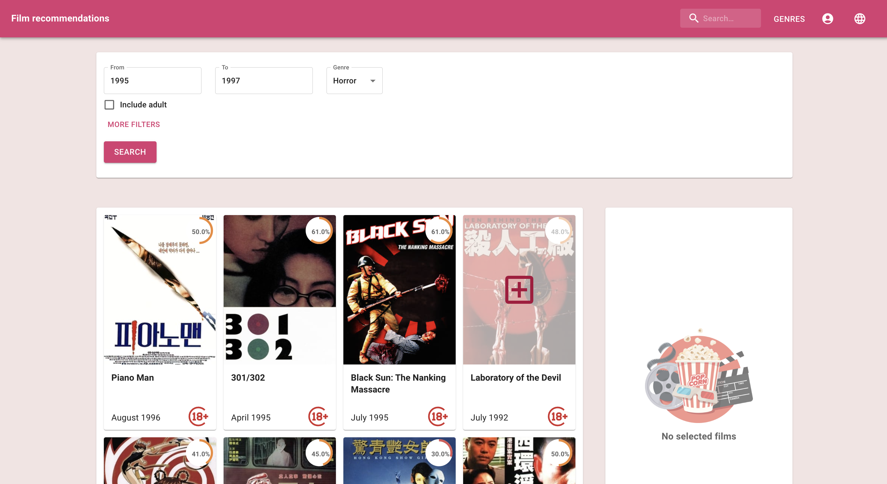
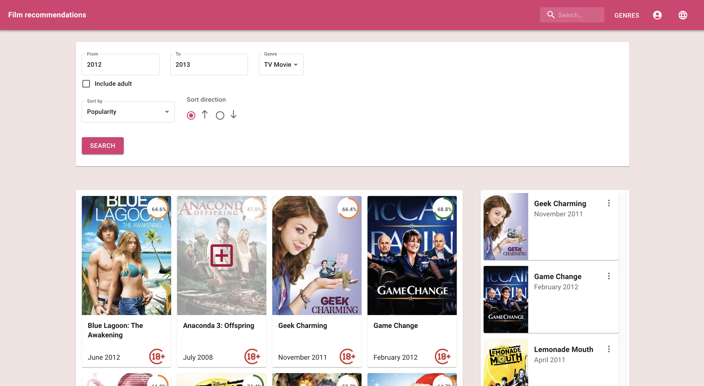

____
____

### Film details

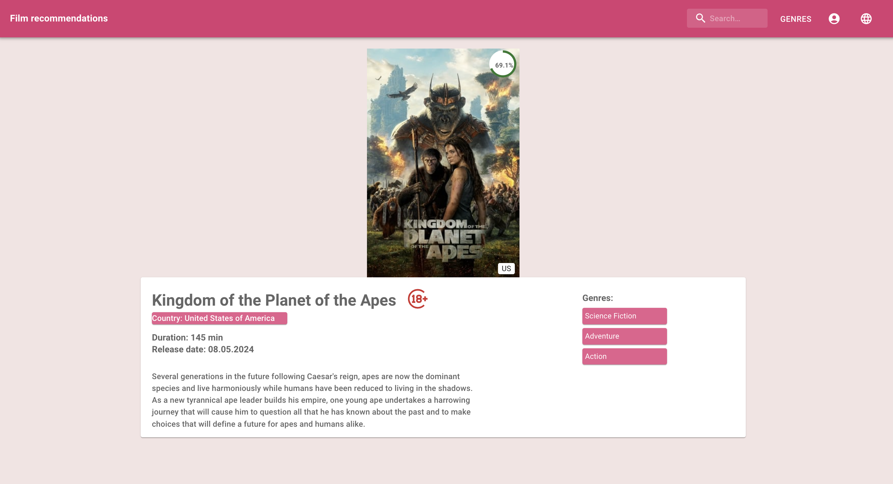

____
____

### Selected films

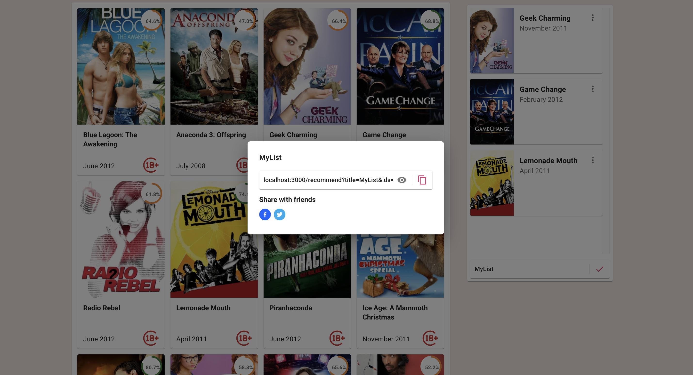
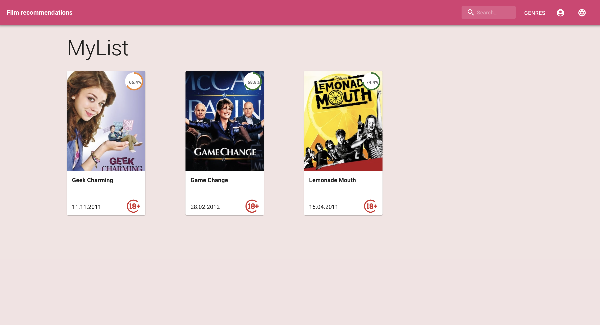

____
____

### Genres

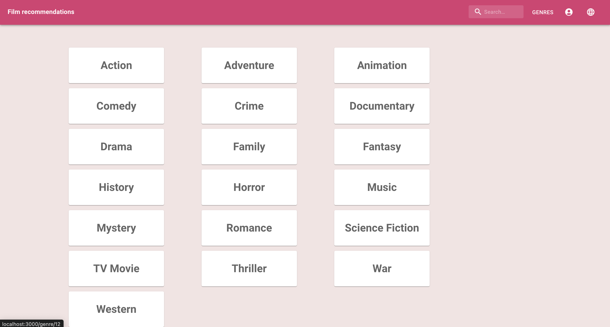

____
____

### Search bar

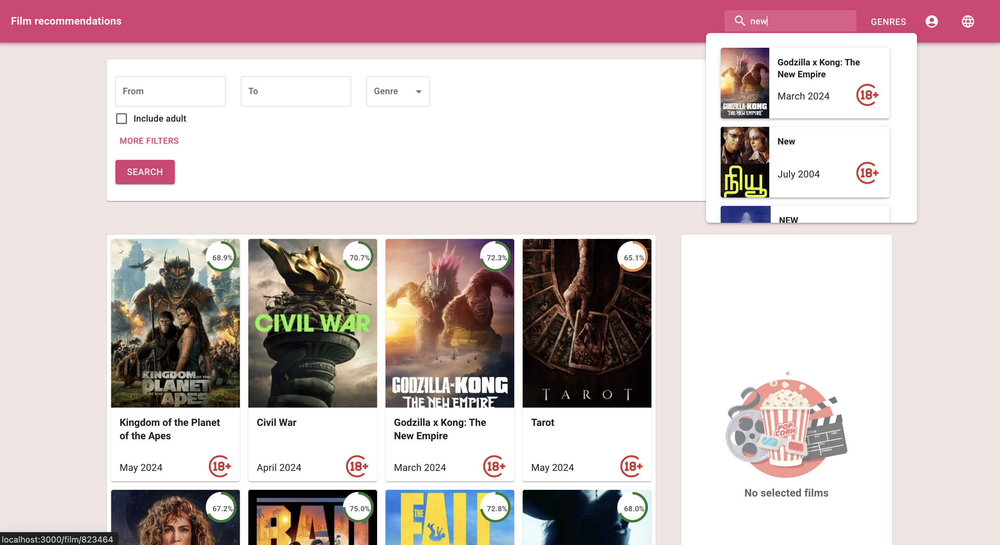

____
____

### User Authentication and Profile

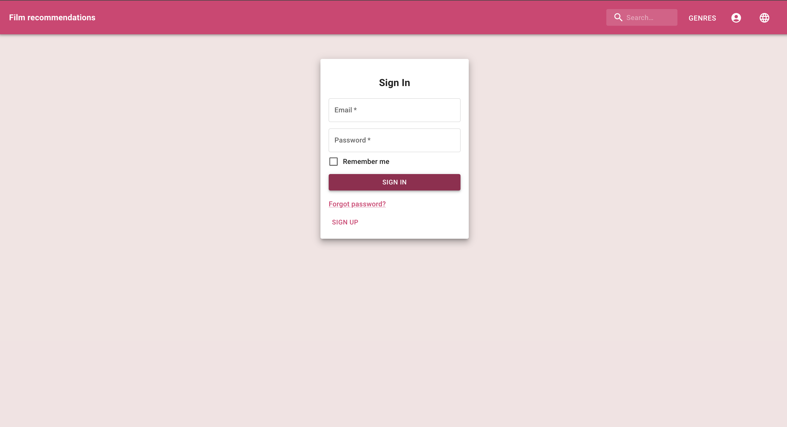
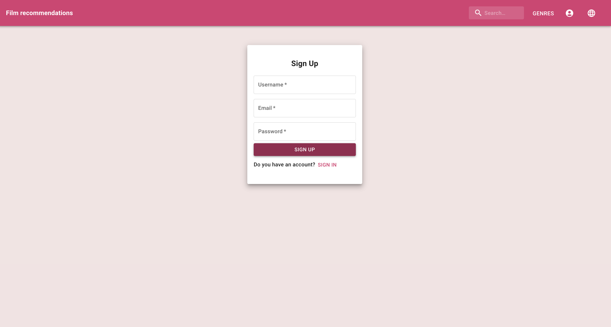
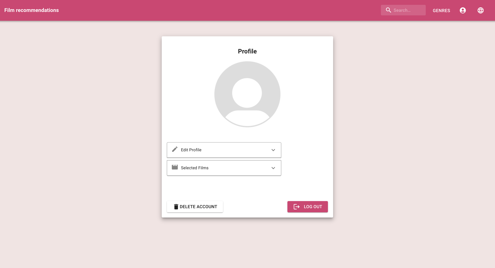
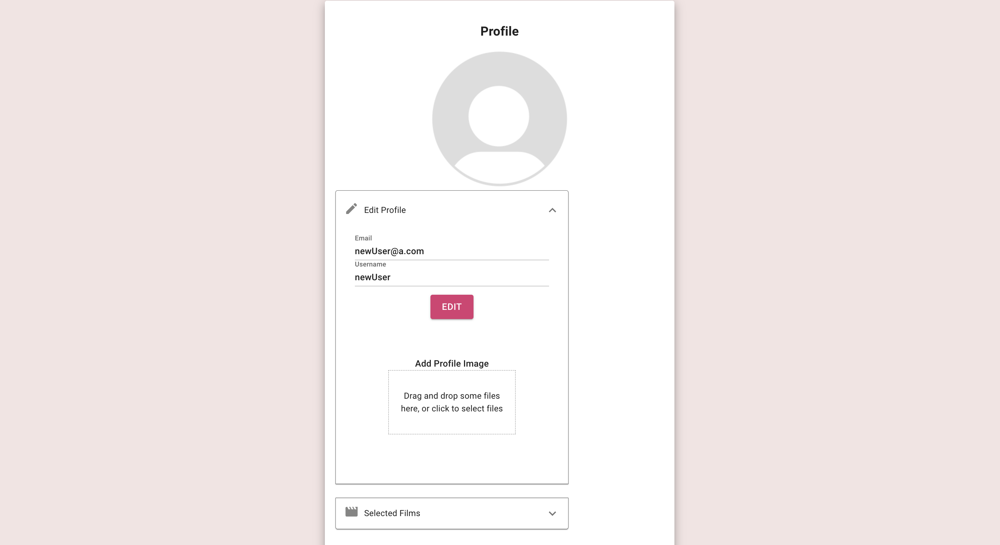
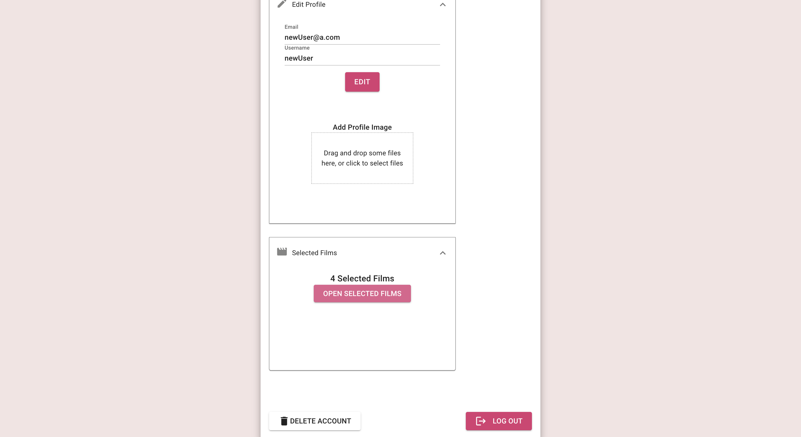

____
____